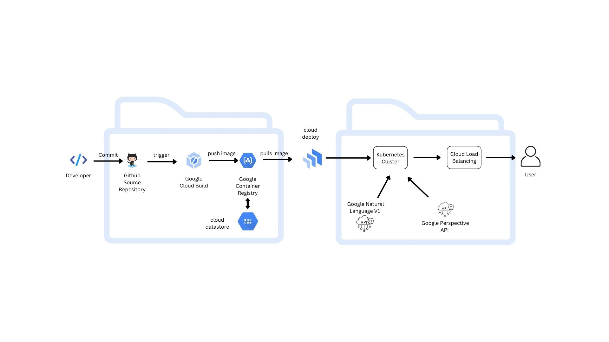
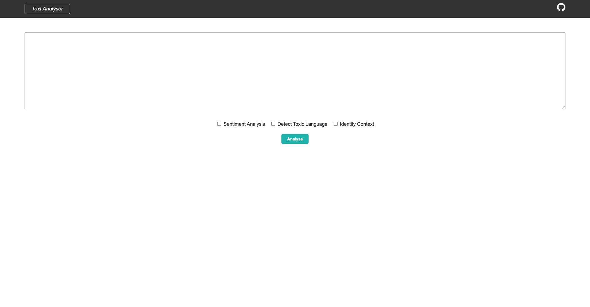
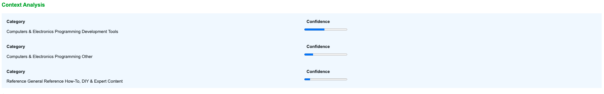
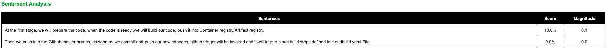
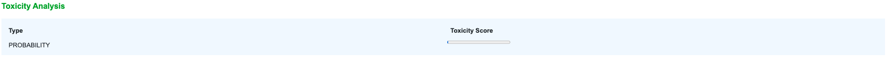
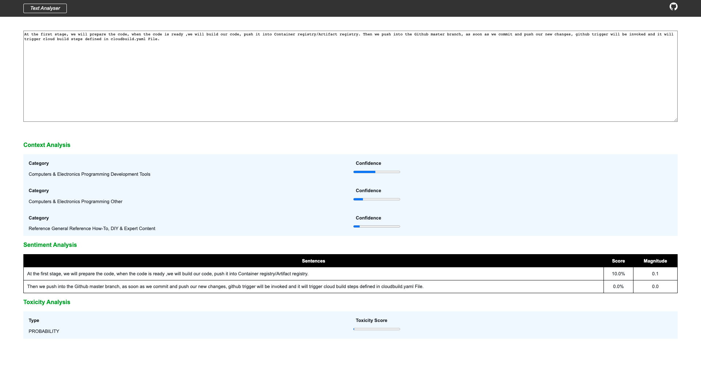


# Text Analyser

## Table of Contents
- [About](#about)
- [Installation](#installation)
- [System Overview](#system-overview)
	- [Terms used for Text Analysis](#terms-used-for-text-analysis)
- [System Architecture](#system-architecture)
- [Application Overview](#application-overview)
- [Application Architecture](#application-architecture)
	 - [Flask App](#flask-app)
	 - [RESTful-API](#restful-api)
	 - [CRUD Operations](#crud-operations)
	 - [External APIs Used](#external-apis-used)
	 	- [Google Natural Language API](#google-natural-language-api)
		- [External API- Perspective API](#external-api-perspective-api)
- [Cloud Infrastructure](#cloud-infrastructure)
    - [Google Cloud](#google-cloud)
    - [Cloud Datastore](#cloud-datastore)
	- [Kubernetes](#kubernetes)
	- [Docker](#docker)


## About 

In today's world toxic content is much higher in social media and in other services. A text analyser can be used to analyse the sentiment of content, measuring the toxicity and analysing the context of the content. This analyser is developed using 
- External API (Google Natural Language V1) for sentiment and Context analysis.
- Perspective API (Perspective) for toxicity. 

This application is developed using python and flask. 


## Installation

Using Flask to build a Text Analyser with Restful API Server.


### Pre-requisites:
- [Python 3.10](https://www.python.org/downloads/release/python-3100/)
- [Google Cloud Platform]()
- [Cloud Datastore Emulator]()
- [Perspective API Account]()
- [Google Natural Language V1]()


## Installation

1. Clone the repository

	```sh
	git clone https://github.com/thesouleddev/text-analyser.git
	```
2. Create virtual environment and install requirements with pip

	```sh
	python3 -m venv venv
	pip install -r requirements.txt
	```

3. Create Service Account on Google Cloud Console, we will need this service account json to setup and access Cloud Datastore. The account creation can be done by following the steps given in this [link](https://cloud.google.com/iam/docs/creating-managing-service-accounts).

	After creating the service account, download the service account json (sa.json) from console and move it to the application root directory. 

4. Create account on [Perspective platform](https://developers.perspectiveapi.com/s/?language=en_US), which we will be using to analyse toxicity of the content. After creation the API needs to be enabled on the Google Cloud APIs.

	Update PERSPECTIVE_API_KEY in the config.py under class Config

	```py
	class Config:
		PERSPECTIVE_API_KEY = ""
	```

5. Enable [Google Natural Language API](https://cloud.google.com/natural-language/docs/basics) on the console, this service will be used to analyse context and sentiment of the given document.

6. Export environment variables

	```sh
	source local_env.sh
	```
7. Run the application locally
	```sh
	python main.py
	```

### Flask Application Structure 
```
.
|──────text-analyser/
| |────modules/
| | |────text-analyser/
| | |──────__init__.py
| | |──────analyser.py
| | |──────base.py
| | |──────views.py
| |────models/
| | |────odb/
| | |──────__init__.py
| | |──────ndb.py
| | |────text_analyser.py/
| | |────users.py
| |────static/
| | |────styles/
| | |──────styles.css
| | |──────text-analyser.css
| |────template/
| | |────text_analyser/
| | |──────display.html
| | |──────document_render.html
| | |────header.html
| | |────.gitignore
| | |────Dockerfile
| | |────LICENSE
| | |────README.md
| | |────config.py
| | |────deployment.yaml
| | |────local_env.sh
| | |────main.py
| | |────requirements.txt
| | |────service.yaml
| | |────wsgi.py
| | |────sa.json
```

### Run flask for development
```
$ python main.py
```
### Run flask for production


```
$ gunicorn -w 4 -b 127.0.0.1:5000 run:app

```

* -w : number of worker
* -b : Socket to bind


### Run with Docker

```
$ docker build -t text-analyser .

$ docker run -p 5000:5000 --name text-analyser text-analyser
 
```

## System Overview

The front-end serves as a seamless user interface that works as an website. The backend is a Restful service interface for CRUD operations (for example, data query of text content) deployed via google cloud to facilitate scalable performance with kubernetes of the dockerized image. SSL deployments are facilitated through Google Cloud. The application interacts with Google Natural Language V1 and Perspective API for sentiment, context and perspective analysis respectively. Furthermore, the application uses google cloud datastore as database to store our text content information.

### Terms used for Text Analysis

- **Context Analysis** : A contextual analysis is simply an analysis of a text (in whatever medium, including multi-media) that helps us to assess that text within the context of its historical and cultural setting, but also in terms of its textuality – or the qualities that characterise the text as a text.
- **Magnitude** : The magnitude shows the intensity or magnitude value of that sentence. a magnitude is a number ranging from 0 to infinity. It represents the weight of sentiment expressed in the statement, regardless of being positive or negative. Longer blocks of text with heavily weighted statements have higher magnitude values.
- **Score** : The Sentiment score is a number and ranges from -1 to +1. -1 is really bad to +1 being very good. Anything close to 0 is a neutral score.
- **Category** : Categorisation in text mining means sorting documents into groups. Automatic document classification uses a combination of natural language processing (NLP) and machine learning to categorise customer reviews, support tickets, or any other type of text document based on their contents.
		-  Business, Interest
		-	Computers, Computer_keyboards
		-	Condiments_and_Sweeteners, Marinades
		-   Energy, Fuel_gas
		-   Fashion, Jackets
		-   Food, Savoury_pies

## System Architecture



## Application Overview


### Main Page
This will be the initial dashboard page, where user will input the document inside the text box. Multiple analysis such as context, sentiment and toxicity can be generated by selecting the check box. 



After clicking the analyse button the report(s) are generated for the same.

### Context Analysis



### Sentiment Analysis



### Toxicity Analysis



### Overall Result Page



## Application Architecture

### Flask App

Flask is a small and lightweight Python web framework that provides useful tools and features that make creating web applications in Python easier. It gives developers flexibility and is a more accessible framework for new developers since you can build a web application quickly using only a single Python file. Flask is also extensible and doesn’t force a particular directory structure or require complicated boilerplate code before getting started.

Flask uses the Jinja template engine to dynamically build HTML pages using familiar Python concepts such as variables, loops, lists, and so on. 

### RESTful-API

A REST API (also known as RESTful API) is an application programming interface (API or web API) that conforms to the constraints of REST architectural style and allows for interaction with RESTful web services. REST stands for representational state transfer and was created by computer scientist Roy Fielding.

**Flask-RESTful** is an extension for Flask that adds support for quickly building REST APIs. It is a lightweight abstraction that works with your existing ORM/libraries. Flask-RESTful encourages best practices with minimal setup. If you are familiar with Flask, Flask-RESTful should be easy to pick up.

### CRUD Operations 

CRUD stands for "Create, Read, Update, and Delete," which are the four basic database operations. Many HTTP services also model CRUD operations through REST or REST-like APIs.

The four main HTTP methods (GET, PUT, POST, and DELETE) can be mapped to CRUD operations as follows:

-   GET retrieves the representation of the resource at a specified URI. GET should have no side effects on the server.
-   PUT updates a resource at a specified URI. PUT can also be used to create a new resource at a specified URI, if the server allows clients to specify new URIs. For this tutorial, the API will not support creation through PUT.
-   POST creates a new resource. The server assigns the URI for the new object and returns this URI as part of the response message.
-   DELETE deletes a resource at a specified URI.

### External APIs Used

An API is a set of definitions and protocols for building and integrating application software. It’s sometimes referred to as a contract between an information provider and an information user—establishing the content required from the consumer (the call) and the content required by the producer (the response). 

The APIs that are used in the project are described below:

#### Google Natural Language API

The Natural Language API **provides a powerful set of tools for analysing and parsing text through syntactic analysis**. To perform syntactic analysis, use the analyse Syntax method. Syntactic Analysis consists of the following operations: Sentence extraction breaks up the stream of text into a series of sentences.

#### External API- Perspective API

Perspective uses machine learning models to identify abusive comments. The models score a phrase based on the perceived impact the text may have in a conversation. Developers and publishers can use this score to give feedback to commenters, help moderators more easily review comments, or help readers filter out “toxic” language.

Perspective models provide scores for several different attributes. In addition to the flagship Toxicity attribute, here are some of the other attributes Perspective can provide scores for:

-   Severe Toxicity
-   Insult
-   Profanity
-   Identity attack
-   Threat
-   Sexually explicit


## Cloud Infrastructure

**Cloud computing infrastructure** is the collection of hardware and software elements needed to enable cloud computing. It includes computing power, networking, and storage, as well as an interface for users to access their virtualised resources. The virtual resources mirror a physical infrastructure, with components like servers, network switches, memory and storage clusters.

 **Why Cloud Computing Infrastructure?**
 
Cloud infrastructure offers the same capabilities as physical infrastructure but can provide additional benefits like a lower cost of ownership, greater flexibility, and scalability.

Cloud computing infrastructure is available for private cloud, public cloud, and hybrid cloud systems. It’s also possible to rent cloud infrastructure components from a cloud provider, through cloud infrastructure as a service (Iaas). Cloud infrastructure systems allow for integrated hardware and software and can provide a single management platform for multiple clouds.

### Google Cloud

Why google cloud? 

Google Cloud Platform (GCP) naturally offers a more limited range of services and doesn’t command the same global spread of data centre offered by AWS and Azure. It does, however, give customers a highly specialised service in three main streams: big data, machine learning, and analytics, with good scale and stable load balancing, as well as those famously low response times. Google’s container offering provides users with a significant advantage as it developed the very Kubernetes standard now utilised by competitors AWS and Azure.

Customers tend to choose GCP as a secondary vendor in a hybrid solution, though it is becoming increasingly popular with organisations that are direct competitors with Amazon, and therefore cannot use AWS. It’s important to note that GCP is very open-source- and DevOps-centric, and as a result does not integrate as well with Microsoft Azure.

This distribution of resources provides several benefits, including redundancy in case of failure and reduced latency by locating resources closer to clients. This distribution also introduces some rules about how resources can be used together.

The backend is currently accessible as a  flask application on Google cloud (Google Kubernetes Engine).

[http://34.105.204.16:8000/](http://34.105.204.16:8000/)

This deployment configured with **load balancer**

#### Cloud Datastore

Why Google Cloud Datastore?

Datastore is a highly scalable NoSQL database. Datastore automatically handles sharding and replication, providing the application with a highly available and durable database that scales automatically to handle incoming load. Datastore provides a myriad of capabilities such as ACID transactions, SQL-like queries, indexes, and much more.

-   Product catalogs that provide real-time inventory and product details for a retailer.
-   User profiles that deliver a customised experience based on the user’s past activities and preferences.
-   Transactions based on ACID properties, for example, transferring funds from one bank account to another.

Datastore features include:

-   **Atomic transactions**. Datastore can execute a set of operations where either all succeed, or none occur.
-   **High availability of reads and writes**. Datastore runs in Google data centres, which use redundancy to minimize impact from points of failure.
-   **Massive scalability with high performance**. Datastore uses a distributed architecture to automatically manage scaling. Datastore uses a mix of indexes and query constraints so your queries scale with the size of your result set, not the size of your data set.
-   **Flexible storage and querying of data**. Datastore maps naturally to object-oriented and scripting languages, and is exposed to applications through multiple clients. It also provides a SQL-like query language.
-   **Balance of strong and eventual consistency**. Datastore ensures that entity lookups by key and ancestor queries always receive strongly consistent data. All other queries are eventually consistent. The consistency models allow your application to deliver a great user experience while handling large amounts of data and users.    
-   **Encryption at rest**. Datastore automatically encrypts all data before it is written to disk and automatically decrypts the data when read by an authorised user. For more information, see Server-Side Encryption.
-   **Fully managed with no planned downtime**. Google handles the administration of the Datastore service so you can focus on your application. Your application can still use Datastore when the service receives a planned upgrade.

### Kubernetes

Kubernetes is a portable, extensible, open source platform for managing containerised workloads and services, that facilitates both declarative configuration and automation. It has a large, rapidly growing ecosystem. Kubernetes services, support, and tools are widely available.

Kubernetes, at its basic level, is a system for running and coordinating containerised applications across a cluster of machines. It is a platform designed to completely manage the life cycle of containerised applications and services using methods that provide predictability, scalability, and high availability.

Kubernetes allows users to run scalable, highly available containerised workloads on a highly abstracted platform. While Kubernetes’ architecture and set of internal components can at first seem daunting, their power, flexibility, and robust feature set are unparalleled in the open-source world.

**service.yaml** contains Kubernetes load-balancer configuration for the project.

```yaml
apiVersion: v1
kind: Service
metadata:
  name: text-analyer
spec:
  type: LoadBalancer
  selector:
    app: text-analyer
  ports:
    - port: 80
      targetPort: 8082
 ```

**deployment.yaml** contains Kubernetes nodes and replicas configuration for the project.

```yaml
apiVersion: apps/v1
kind: Deployment
metadata:
  name: text-analyer
  labels:
    name: text-analyer
spec:
  replicas: 2
  selector:
    matchLabels:
      name: text-analyer
  template:
    metadata:
      name: text-analyer
      labels:
        name: text-analyer
    spec:
      containers:
        - name: text-analyer
          image: gcr.io/eminent-enigma-364712/text-analyser:v1.0
          ports:
            - containerPort: 8082
  ```

### Docker

Docker is an open platform for developing, shipping, and running applications. Docker enables you to separate your applications from your infrastructure so you can deliver software quickly. With Docker, you can manage your infrastructure in the same ways you manage your applications. By taking advantage of Docker’s methodologies for shipping, testing, and deploying code quickly, you can significantly reduce the delay between writing code and running it in production.

Docker provides the ability to package and run an application in a loosely isolated environment called a container. The isolation and security allows you to run many containers simultaneously on a given host. Containers are lightweight and contain everything needed to run the application, so you do not need to rely on what is currently installed on the host. You can easily share containers while you work, and be sure that everyone you share with gets the same container that works in the same way.

Docker provides tooling and a platform to manage the lifecycle of your containers:

-   Develop your application and its supporting components using containers.
-   The container becomes the unit for distributing and testing your application.
-   When you’re ready, deploy your application into your production environment, as a container or an orchestrated service. This works the same whether your production environment is a local data centre, a cloud provider, or a hybrid of the two.

